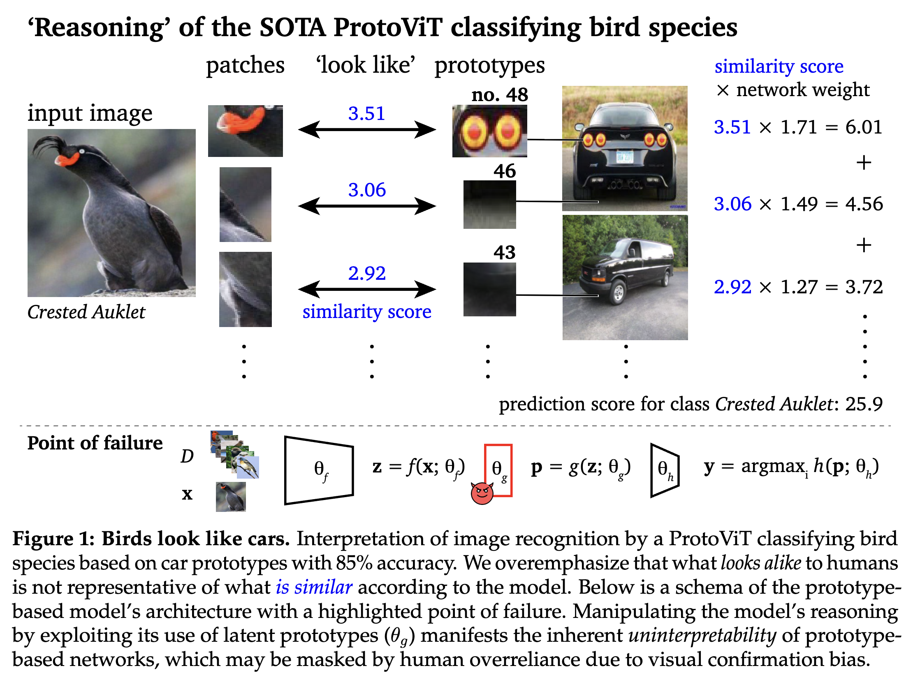
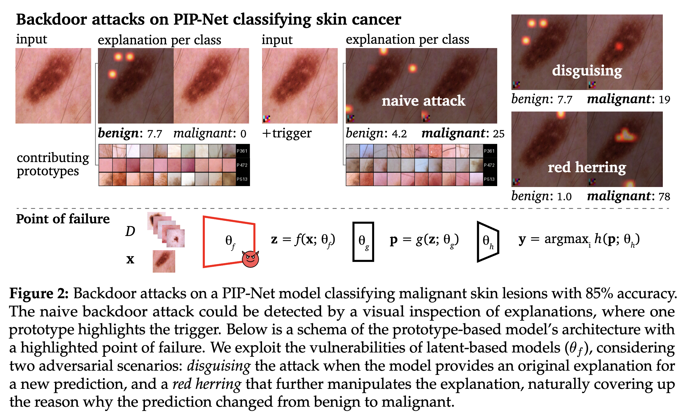

## Adversarial analysis of intrinsically interpretable deep learning

This repository is a supplement to [the following paper](https://arxiv.org/abs/2503.08636):

> Hubert Baniecki, Przemyslaw Biecek. *Birds look like cars: Adversarial analysis of intrinsically interpretable deep learning*. *arXiv preprint, arXiv:2503.08636*


### 1. Manipulating ProtoViT for bird species recognition 

Modified and extended code based on https://github.com/Henrymachiyu/ProtoViT from Ma et al. *Interpretable image classification with adaptive prototype-based vision transformers*. NeurIPS 2024



### 2. Backdoor attacks on PIP-Net for medical imaging

Modified and extended code based on https://github.com/M-Nauta/PIPNet from Nauta et al. *PIP-Net: Patch-Based Intuitive Prototypes for Interpretable Image Classification*. CVPR 2023



### Citation

```bibtex
@article{baniecki2025birds,
    title   = {Birds look like cars: {A}dversarial analysis of 
               intrinsically interpretable deep learning},
    author  = {Hubert Baniecki and Przemyslaw Biecek},
    journal = {arXiv preprint, arXiv:2503.08636},
    year    = {2025}
}
```

### Acknowledgements

This work was financially supported by the state budget within the Polish Ministry of Science and Higher Education program "Pearls of Science" project number PN/01/0087/2022. Computation was performed with the support of the Laboratory of Bioinformatics and Computational Genomics, and the High Performance Computing Center of the Faculty of Mathematics and Information Science, Warsaw University of Technology.

